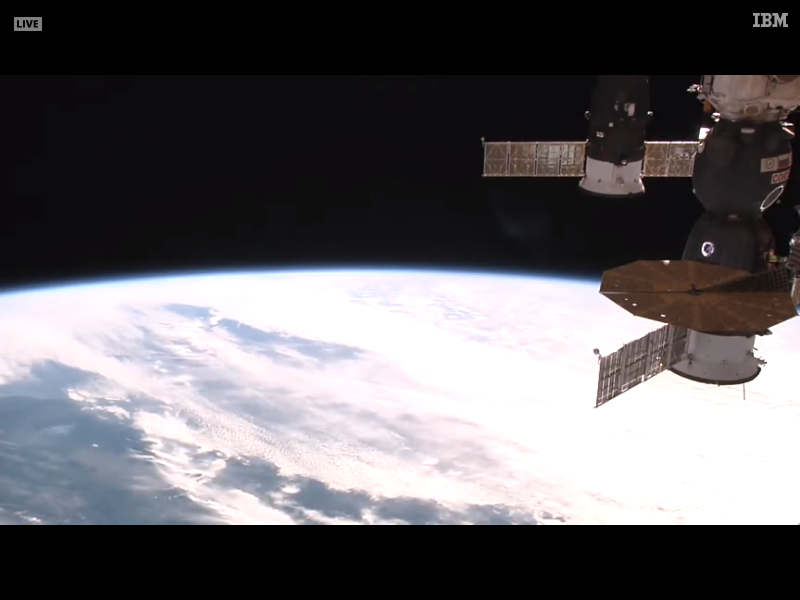

# ISSac
###### Version: 0.1.0

### Description

ISSac is an Electron application built solely to view the International Space Station's (ISS) live feed. Why... Because why not?

### Screenshot

### Installation

#### Linux:
- Clone or download the repo.
- Install the dependencies with the following command. `npm i`
- Package the application with the following command. `npm run package-linux`
- Build the application with the following command. `npm run build-linux`
- You will now find an installable .deb file in the `release-builds/linux/` directory.

#### macOS:
- Coming soon.

#### Windows:
- Coming soon.

##### Enjoy!
